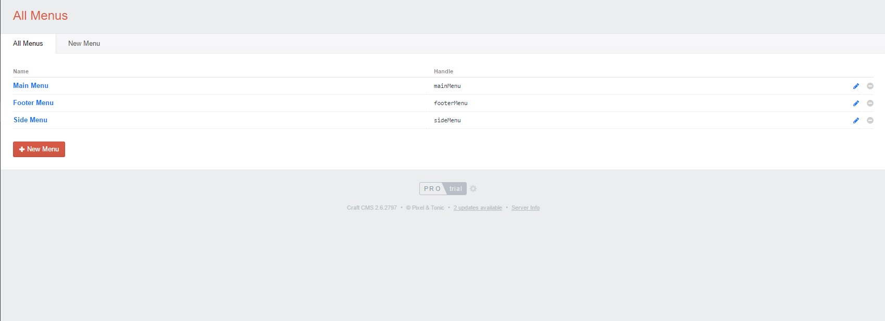
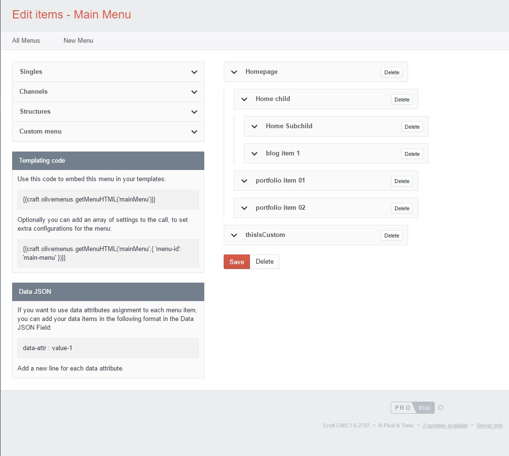

# Olive Menus
A powerful menus plugin for Craft CMS built for the need of simplicity and flexibility

## Installation

To install Olive Menus, follow these steps:

1. Download & unzip the file and place the `olivemenus` directory into your `craft/plugins` directory
2.  -OR- do a `git clone https://github.com/OliveStudio/olivemenus.git` directly into your `craft/plugins` folder.  You can then update it with `git pull`
4. Install plugin in the Craft Control Panel under Settings > Plugins
5. The plugin folder should be named `olivemenus` for Craft to see it.  GitHub recently started appending `-master` (the branch name) to the name of the folder for zip file downloads.

Olive Menus works on Craft 2.4.x, Craft 2.5.x, and Craft 2.6.x.

The Olive Menus plugin requires PHP 5.4 or later.

## Overview

Olive Menus is an easy to use Craft CMS plugin which allows you to build custom menus from scratch. You can create a new menu within seconds, simply by selecting single entries, channel or structure items, or even custom links. Then all you need to do is include a twig snippet to embed the menu in your template, and just like magic your menu appears!

You can create and manage multiple menus on your website; Olive Menus is highly customisable and it makes it easy for you to access and edit your menus once created. You can easily see all your single entries, channel items and structure items displayed in an organized manner and you can add them to your menu with a single click. It is also very easy to include your own custom or external links and even join them together in the same menu with the existing entries on your website.

The menu structure can be edited just by dragging the chosen entries around. It is easy to change the order of your items by moving them up or down and you can even create dropdown menus by dragging the entries to the right or identing them. 

Olive Menus gives you the posibility to single out a menu by giving it an id in order to make extra configurations to it. 

Another awesome and very useful feature that Olive Menus provides you with is the opportunity to asign data attributes to every element in your menu, so that more advanced events can be triggered when users click on particular menu items.

## Documentation

Please read the complete documentation in the [Olive Menus Wiki](https://github.com/OliveStudio/olivemenus/wiki) or read the `DOCS.md` file in the repo.

## Roadmap

Some things to do, and ideas for potential features:

## Changelog

### 1.0.0 -- 2016.07.20

* Initial release

Brought to you by [Olive Studio Team](http://www.olivestudio.net)

