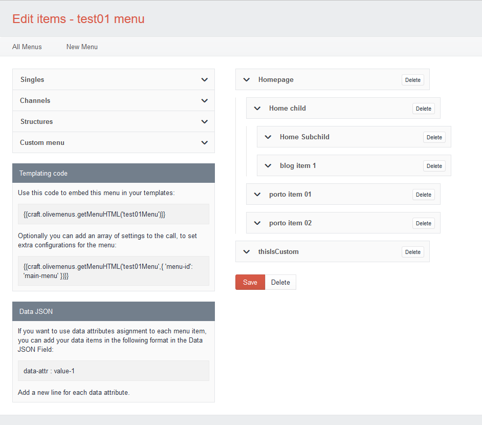

# Olive Menus
A powerful menus plugin for Craft CMS built for the need of simplicity and flexibility

## Installation

To install Olive Menus, follow these steps:

1. Download & unzip the file and place the `olivemenus` directory into your `craft/plugins` directory
2.  -OR- do a `git clone https://github.com/OliveStudio/olivemenus.git` directly into your `craft/plugins` folder.  You can then update it with `git pull`
4. Install plugin in the Craft Control Panel under Settings > Plugins
5. The plugin folder should be named `olivemenus` for Craft to see it.  GitHub recently started appending `-master` (the branch name) to the name of the folder for zip file downloads.

Olive Menus works on Craft 2.4.x, Craft 2.5.x, and Craft 2.6.x.

The Olive Menus plugin requires PHP 5.4 or later.

## Overview

## Documentation

Please read the complete documentation in the [Olive Menus Wiki](https://github.com/OliveStudio/olivemenus/wiki) or read the `DOCS.md` file in the repo.

## Roadmap

Some things to do, and ideas for potential features:

## Changelog

### 1.0.0 -- 2016.07.20

* Initial release

Brought to you by [Olive Studio Team](http://www.olivestudio.net)

